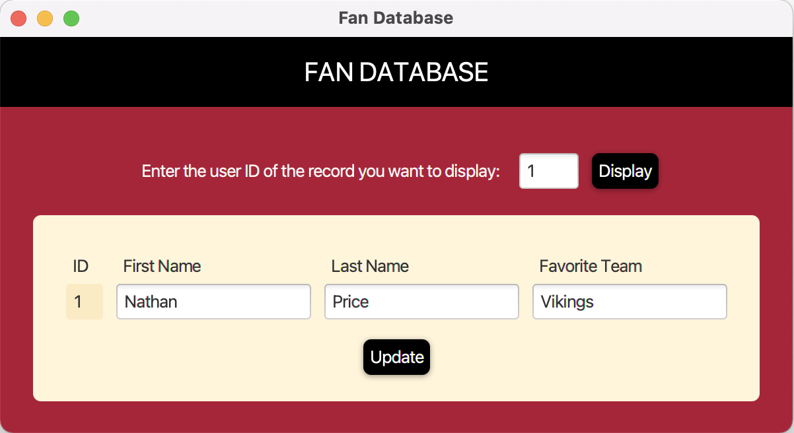

<h2>Fan Database 🏈 🚩</h2>
<h4>
  A simple Java program to store, manipulate, and display data about sports' fans favorite teams,
  this was created for a Java class assignment based on the following requirements:
</h4>
<ul>
  <li>
    Create a program using JavaFX which connects to a  MySQL database
      <ul><li>Database should have a table 'fans' with columns 'ID', 'firstname', 'lastname', and 'favoriteteam'</li></ul>
  </li>
  <li>
    Include a 'Display' button which displays information from the database based on a user ID input by the user
  </li>
  <li>
    Include an 'Update' button which updates the currently displayed record's information in the database
  </li>
</ul>

  
  

<h3>Languages</h3>

<b>Java/JavaFX | MySQL | CSS</b>

<h3>Features</h3>
  🔎 Easily search for a record by user ID
   
  🔃 Easily update user information (besides user ID) when a record is displayed
   
  ⚠️ Brief alert messages indicate whether an update was successful or not

<h3>Requirements to run</h3>
<ul>
  <li>MySQL (run fan-database-init.sql file to initialize a sample database)</li>
  <li>JavaFX (included in Java SE 8; for later versions, JavaFX jar files must be downloaded and referenced)</li>
  <li>MySQL JDBC driver</li>
 </ul>
